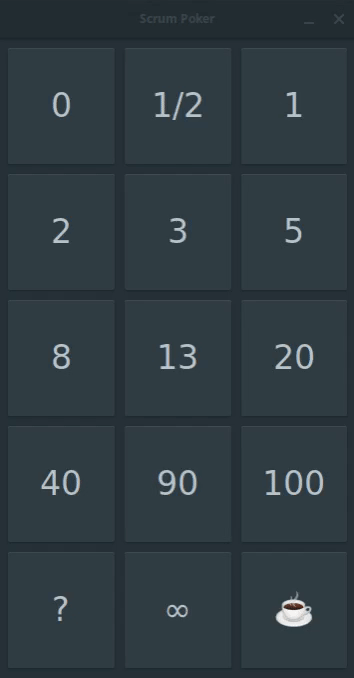

# ScrumPoker
[](http://www.gnu.org/licenses/gpl-3.0)

ScrumPoker is a simple and useful scrum planning poker App. It helps you by making your estimation meetings more effective.



## Building from source

#### Option 1: with GNOME Builder
Open GNOME Builder, click the "Clone..." button, paste the repository url.
Clone the project and hit the Run button to start building ScrumPoker.

#### Option 2: with Meson
##### Prerequisites:
* Gtk >= 3.22.0
* libhandy >= 0.0.7
* Meson >= 0.47.0
* Git

```
git clone https://github.com/dcordero/ScrumPoker.git
cd ScrumPoker
meson . _build
ninja -C _build
sudo ninja -C _build install
```
